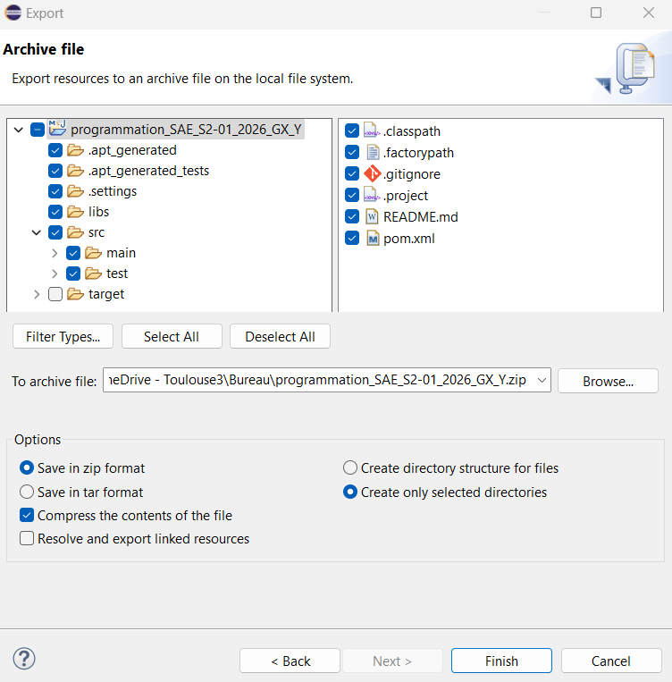

# SAE S2-01 — Guide de prise en main du projet

========
 IMPORTANT — RENOMMER ET CONFIGURER LE PROJET EN PREMIER
========

Avant toute chose, effectuez les opérations suivantes dans l'ordre.

=======================================================================

## ÉTAPE 1 — Récupérer et préparer le projet

1. Dézipper programmation_SAE_S2-01_2025_GX_Y.zip dans un dossier
   temporaire (pas encore dans le workspace Eclipse).

2. Renommer le dossier dézippé en remplaçant GX par la lettre de votre
   groupe et Y par votre numéro d'équipe.
   Exemple pour le groupe A, équipe 3 :
     programmation_SAE_S2-01_2025_GX_Y  →  programmation_SAE_S2-01_2025_GA_3

3. Ouvrir le fichier pom.xml avec un éditeur texte (Notepad, Notepad++...)
   et modifier la ligne artifactId pour qu'elle corresponde exactement
   au nouveau nom du dossier :
     Avant : <artifactId>programmation_SAE_S2-01_2025_GX_Y</artifactId>
     Après : <artifactId>programmation_SAE_S2-01_2025_GA_3</artifactId>
             (exemple groupe A équipe 3)
   Sauvegarder le fichier pom.xml.

4. Déplacer le dossier renommé dans le workspace Eclipse :
     C:\Users\<votre-nom>\eclipse-workspace\
   Résultat attendu :
     eclipse-workspace\programmation_SAE_S2-01_2025_GA_3\

---

## ÉTAPE 2 — Importer dans Eclipse

File → Import → Maven → Existing Maven Projects
→ Browse… → pointer sur votre dossier renommé
           (ex: programmation_SAE_S2-01_2025_GA_3)
→ Finish

---

## ÉTAPE 3 — Installer annotation-lib dans Maven (une seule fois sur votre machine)

Clic droit sur le projet → Run As → Maven build…

Coller intégralement dans le champ Goals :

    install:install-file -Dfile=libs/annotation-lib-0.0.1-SNAPSHOT.jar -DpomFile=libs/annotation-lib-0.0.1-SNAPSHOT.pom -DgroupId=fr.iut-tlse3.fr -DartifactId=annotation-lib -Dversion=0.0.1-SNAPSHOT -Dpackaging=jar

Cliquer Run → vérifier BUILD SUCCESS

Puis : clic droit sur le projet → Maven → Update Project → OK

---

## ÉTAPE 4 — Annoter le code

Ajouter en tête de chaque fichier Java :

    import fr.iut.annotations.Responsable;

Poser l'annotation sur CHAQUE méthode et CHAQUE constructeur,
publics ET privés :

    // Un seul responsable
    @Responsable("Prénom NOM")
    public void maMethode() { ... }

    // Sur un constructeur
    @Responsable("Prénom NOM")
    public MaClasse() { ... }

    // Deux responsables (co-responsabilité)
    @Responsable({"Prénom1 NOM1", "Prénom2 NOM2"})
    private void methodePartagee() { ... }

Règles obligatoires :
  - Format : "Prénom NOM" 
  - Le même format partout dans le projet
  - Tout membre sans annotation génère un warning orange dans l'éditeur

---

## ÉTAPE 5 — Rendre le projet

1. Dans Eclipse, supprimer le dossier target/ :
   Clic droit sur target → Delete → OK

2. Exporter le projet en ZIP :
   Clic droit sur le projet → Export… → General → Archive File → Next
   - Vérifier que target/ est bien décoché
   - Choisir l'emplacement du fichier ZIP
   - Cocher créer only selected directories
   - Cliquer Finish
   

3. Vérifier que le nom du ZIP est correct :
     programmation_SAE_S2-01_2025_GA_3.zip  (exemple groupe A équipe 3)

4. Déposer ce ZIP sur Moodle avant la date limite.

=========
 NE PAS inclure le dossier target/ dans le ZIP rendu.
=========
